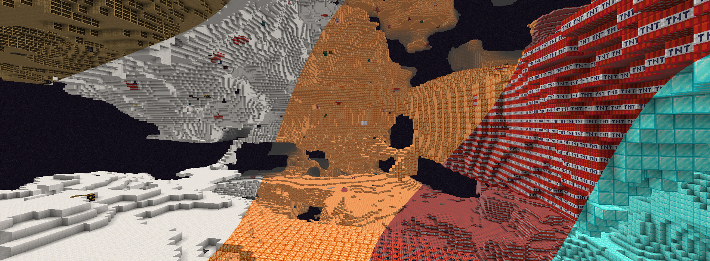

# Any Dimension Mod 2

Create dimensions out of any block! This mod adds 400+ dimensions to the game, one for each of the possible blocks.
Build a portal out of a block and light it with the Any Dimensional Portal Wand! Now compatible with
[Immersive Portals](https://modrinth.com/mod/immersiveportals)!

Also has a couple useful wands to use in creative mode for demonstration purposes.
Download the mod from any of the links below:

- 
     [Get on Modrinth](https://modrinth.com/mod/adm2)
- 
     [Get on CurseForge](https://www.curseforge.com/minecraft/mc-mods/adm2)
- 
     [Get on Planet Minecraft](https://www.planetminecraft.com/mod/adm2)

This mod is the successor to [Any Dimension Mod](https://www.curseforge.com/minecraft/mc-mods/any-dimension-mod-1-7-10)
which was created all the way back in 2015 for Minecraft 1.7.10.

- [Official Website](https://luxmiyu.com/adm2)
- [Discord Server](https://discord.gg/komimau)
- [GitHub Page](https://github.com/luxmiyu/adm2)

If you have any questions or suggestions, feel free to reach out to me on Discord!

### Compatibility with other mods

Any Dimension Mod 2 works with blocks from other mods using data pack and mod expansions!
If you'd like to create your own data pack or mod expansion, check out the GitHub page for
[Any Dimension Mod 2 Data Pack Expansion](https://github.com/luxmiyu/adm2-datapack),
as well as the example mod provided,
[Any Dimension Mod 2 Expansion - Applied Energistics 2](https://github.com/luxmiyu/adm2-ae2).
